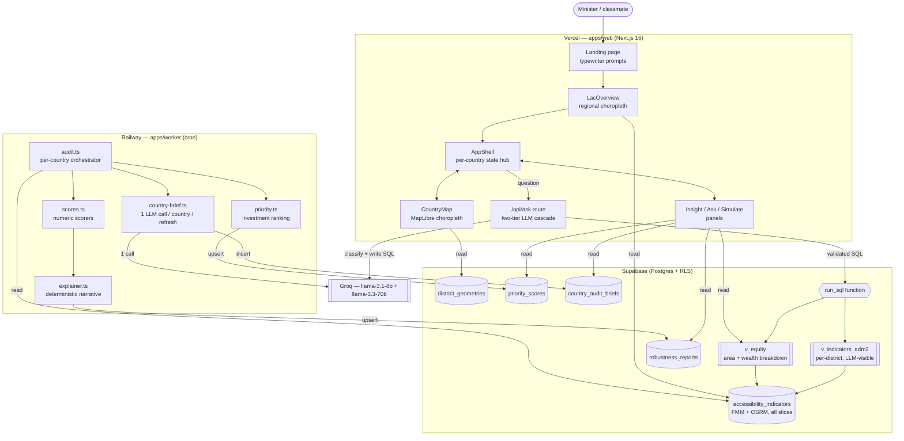
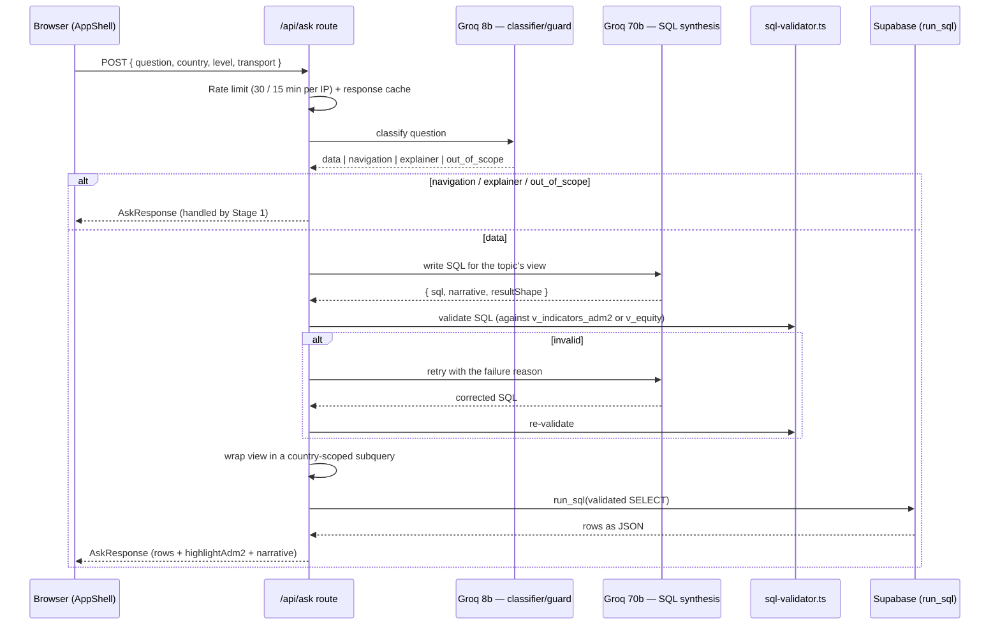
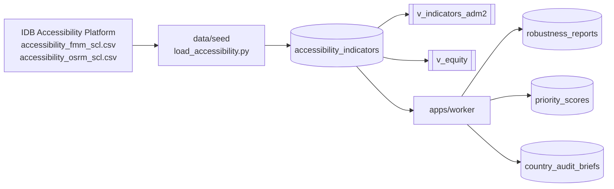
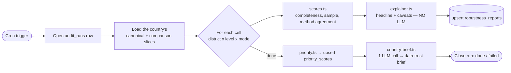

# Architecture — EduAccess LAC

> v4. How the app fits together: a Next.js frontend, a two-tier constrained AI
> chat, a Supabase Postgres database, and a Railway worker. Multi-country —
> Panama and Colombia are live; the schema is built to absorb Costa Rica,
> Ecuador and Peru as their data lands.

## The three deployables

| Piece | Host | Responsibility |
|---|---|---|
| `apps/web` | Vercel | Next.js 16 frontend + the `/api/ask` route |
| `apps/worker` | Railway (cron) | Rebuilds the robustness + priority layer, one run per country |
| Postgres | Supabase | Shared database, curated LLM-visible views, `run_sql` function |

The browser holds only the **anon key** (read-only, RLS-enforced). The
**service-role key** lives only on Vercel server functions and the Railway
worker — it is never shipped to the browser.

## System overview

## Frontend (`apps/web`)

Next.js 16 (App Router), TypeScript, Tailwind v4, MapLibre GL JS v5.

- **`/`** — marketing landing: a typewriter prompt carousel that deep-links
  into the platform.
- **`/platform`** — `PlatformEntry` decides the first view:
  - No country chosen → **`LacOverview`**, the regional map of Latin America.
    Its **Map view** toggle compares all five countries by `Access`,
    `Area gap` (urban − rural) or `Wealth gap` (top − bottom income quintile),
    on a data-relative colour gradient.
  - A country chosen → **`AppShell`**, the per-country workspace: a
    `CountryMap` choropleth plus a side panel with three tabs.

| Panel | Component(s) | Role |
|---|---|---|
| Insight | `IndicatorPanel`, `RobustnessCard`, `PriorityPanel`, `EquityGapCard`, `CountryAuditBrief` | District detail + national priority ranking + equity gaps + data-trust brief |
| Ask | chat UI in `AppShell` | Natural-language questions → `/api/ask` |
| Simulate | `SimulationPanel` | "Inequality in motion" — the map heats up over 60 simulated minutes |

`AppShell` is the client state hub: active country, education level, transport
mode, selected district, chat messages, and simulation clock. Map highlights,
panel content and chat all read from it.

## The chat request flow — two-tier Ask (`/api/ask`)

A question becomes a map highlight (or a UI action) without the LLM ever
touching raw tables or running arbitrary SQL. Two models, by cost:

- **Stage 1 — `llama-3.1-8b-instant`**: a cheap classifier + prompt-injection
  guard. Sorts the question into `data` / `navigation` / `explainer` /
  `out_of_scope`. Navigation, explainer and out-of-scope are answered here —
  the big model is never hit.
- **Stage 2 — `llama-3.3-70b`**: SQL synthesis, for `data` questions only. A
  `topic` tag splits these into `district` (→ `v_indicators_adm2`) and
  `equity` (→ `v_equity`); each has its own SQL-only prompt.

**SQL validator gates** (`apps/web/lib/sql-validator.ts`, a Codex review
target): must start with `SELECT`, no semicolons, references only the one
allowed view, `LIMIT ≤ 50` (or a single-row aggregate), no `pg_*` /
`information_schema` / DDL / DML, allowlisted functions only, and a
`country_iso` filter pinned to the active country. As defence in depth,
`/api/ask` then wraps the view in a country-scoped subquery before execution,
so a query can never read another country's rows regardless of its `WHERE`.

## Database (Supabase Postgres)

| Object | Kind | Role |
|---|---|---|
| `accessibility_indicators` | table | Unified long/tidy table — one row per slice (country × admin level × level × mode × sector × area × quintile × time band × method). Fed by the IDB pipeline; the live source. |
| `district_geometries` | table | Multi-country district polygons, keyed `admin2_pcode`. |
| `robustness_reports` | table | Worker-derived: per-cell trust scores + narrative. |
| `priority_scores` | table | Worker-derived: per-district investment ranking. |
| `country_audit_briefs` | table | Worker-derived: one data-trust paragraph per country. |
| `audit_runs` | table | One row per worker run per country (provenance). |
| `v_indicators_adm2` | view | **LLM-visible.** One row per district × level × mode, pinned to the canonical slice (sector/area/quintile = Total), FMM with OSRM surfaced for comparison. |
| `v_equity` | view | **LLM-visible.** Province + country grain; urban/rural and income-quintile breakdowns. Powers the equity card and equity Ask questions. |
| `districts_adm2` | view | One row per district — the worker iterates this. |
| `run_sql(query)` | function | Executes a validated `SELECT`; service-role only. |

RLS: `anon` reads everything, only `service_role` writes. The LLM never sees a
raw table — only the two curated views, each column documented in its prompt.

## The worker (`apps/worker`, Railway cron)

Each run rebuilds the robustness + priority layer for **one country**.

The per-cell explainer is **deterministic** — the same scores always produce
the same sentence, zero tokens, zero retries. The only LLM call in the worker
is the single country audit brief per refresh (`llm.ts`).

## Robustness scoring

Every number on screen answers "how much do we trust this?" via three scores
(v4 model) combined into a composite:

| Dimension | Meaning |
|---|---|
| `data_completeness` | share of population with usable travel-time data |
| `sample_size` | population magnitude — small N swings wildly |
| `method_agreement` | how closely FMM and OSRM routing agree |

The weakest dimension drives which caveats the explainer emits.

## Deployment

- **Vercel** hosts `apps/web`; a push to `main` triggers `next build` + deploy.
- **Railway** runs `apps/worker` on a cron schedule (Nixpacks build,
  `restartPolicyType = NEVER` — it exits cleanly after each audit).
- **Supabase** is the shared Postgres database. SQL migrations in `data/seed`
  are applied by hand in the SQL editor; deploys ship code, not schema.
