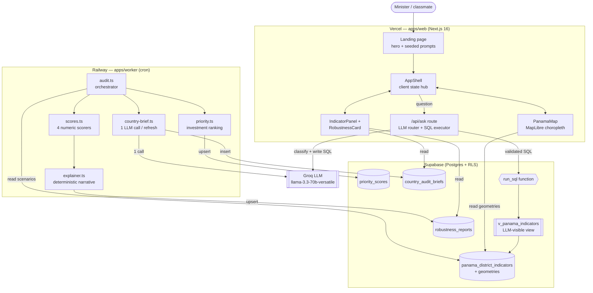
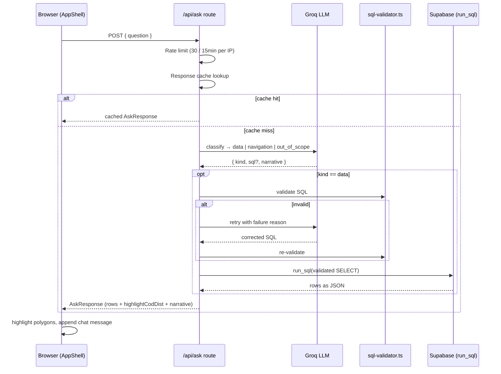
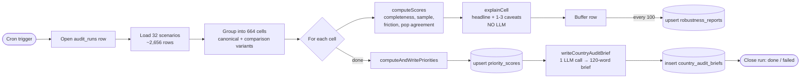
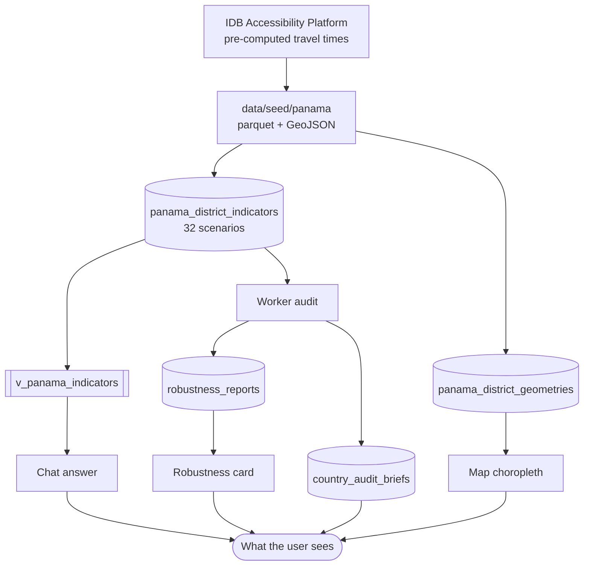

# Architecture — EduAccess LAC

> How the app fits together: a Next.js frontend, a constrained AI chat, a Supabase
> database, and a Railway cron worker. This is the v3 picture (Panama-only).

## System overview

The frontend uses the **anon key** (read-only, RLS-enforced). Only `/api/ask` and the
worker hold the **service-role key** — never shipped to the browser.

## The chat request flow (`/api/ask`)

A user question becomes a map highlight without the LLM ever touching raw tables or
running arbitrary SQL.

**SQL validator gates** (`apps/web/lib/sql-validator.ts`): no semicolons, must start
with `SELECT`, references only `v_panama_indicators`, `LIMIT ≤ 50` (or a single-row
aggregate), no `pg_*` / `information_schema` / DDL / DML, and only allowlisted
functions. The view itself pins one canonical scenario (WorldPop + MAP + walking).

## The worker audit flow (Railway cron)

Each run rebuilds the robustness layer for all 664 cells (83 districts × 4 age groups
× 2 transport modes).

The per-cell explainer is **deterministic** — same scores always produce the same
sentence, zero tokens, zero retries. The only LLM call in the worker is the single
country audit brief per refresh.

## Robustness scoring

Every number on screen answers "how much do we trust this?" via four scores combined
into a composite:

| Dimension | Meaning | Weight |
|---|---|---|
| `data_completeness` | % of population with usable travel-time data | 0.30 |
| `sample_size` | population magnitude — small N swings wildly | 0.20 |
| `friction_agreement` | do MAP and OSM friction surfaces agree? | 0.30 |
| `pop_agreement` | do WorldPop and Census populations agree? | 0.20 |

The weakest dimension drives which caveats the explainer emits.

## Data flow end to end

## Components & responsibilities

| Layer | File | Role |
|---|---|---|
| Frontend | `apps/web/app/page.tsx` | Landing page — hero + seeded prompts |
| Frontend | `apps/web/.../AppShell.tsx` | Client state hub: indicators, chat, selection |
| Frontend | `apps/web/.../PanamaMap.tsx` | MapLibre choropleth + polygon highlight |
| Frontend | `apps/web/.../RobustnessCard.tsx` | 4-dimension trust scores + narrative |
| API | `apps/web/app/api/ask/route.ts` | LLM router, SQL validation, query execution |
| API | `apps/web/lib/sql-validator.ts` | Whitelist validator for LLM-generated SQL |
| API | `apps/web/lib/rate-limit.ts` | Per-IP sliding-window throttle |
| Worker | `apps/worker/src/audit.ts` | Run orchestration + batch writes |
| Worker | `apps/worker/src/scores.ts` | Four deterministic numeric scorers |
| Worker | `apps/worker/src/explainer.ts` | Rule-based narrative + caveats |
| Worker | `apps/worker/src/priority.ts` | Investment-priority ranking |
| Worker | `apps/worker/src/country-brief.ts` | Single LLM call → country audit brief |
| Data | `data/seed/panama/*.sql` | Schema, views, RLS, `run_sql` function |

## Deployment

- **Vercel** hosts `apps/web` — push to GitHub triggers `next build`.
- **Railway** runs `apps/worker` on a cron schedule (Nixpacks build,
  `restartPolicyType = NEVER` so it exits cleanly after each audit).
- **Supabase** is the shared Postgres database; the service-role key lives only on
  Vercel server functions and Railway, never in the browser bundle.
